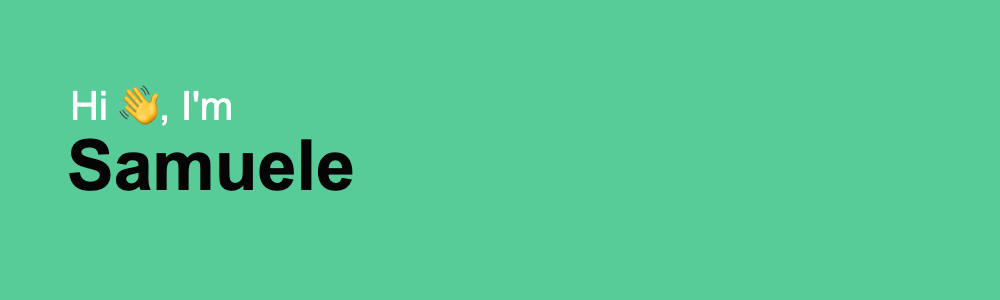

  

 

### 🤖 What I'm Currently Working On:

At the moment the best part of my time is spent working on my startup [Welbemo](https://www.welbemo.com). At Welbemo we try to simplify the wellbeing of the italian companies, in order to make sure that the workers are happy and they can achieve amazing results, both for the company and for themself.

  

 

### 🤙🏻 Other Projects:

I've worked on different projects during the years, you can see the complete list on my [portfolio website](https://www.samuelemonasterolo.com/).

### 🏋🏻‍♂️ Fun Facts:

- 🏃‍♂️ 2 times marathon finisher with a passion for endurance sports
- 💪 Weightlifting enthusiast who believes in balanced mind-body wellness
- 🇮🇹 Proudly working to improve Italian workplace culture
- 🤖 MSc in AI, currently exploring the intersection of technology and human wellbeing with code and no-code tools

 

## 🌐 Socials:

  

 

## 📈 Activity Graph

  

 
 

## 💻 Tech Stack:

### Languages & Frameworks

### Databases & Backend

### Tools & Platforms

 

### 🔥 Streak & Contribution Stats

  

 
 

### 📫 Let's Connect!

  <em>💬 Always open to interesting conversations about tech, AI, wellness, and building meaningful solutions!</em>
   
  <strong>Let's create something amazing together! 🚀</strong>

